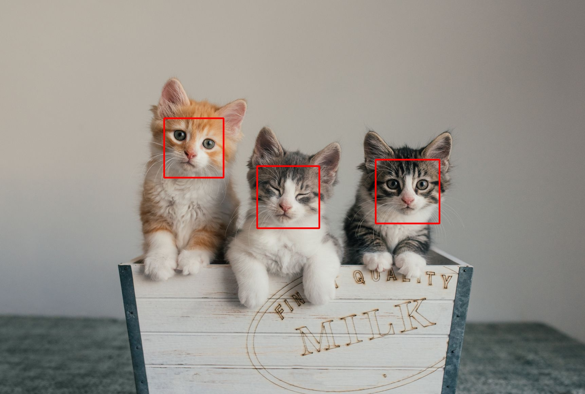
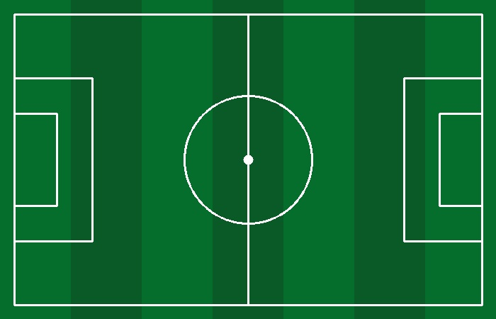
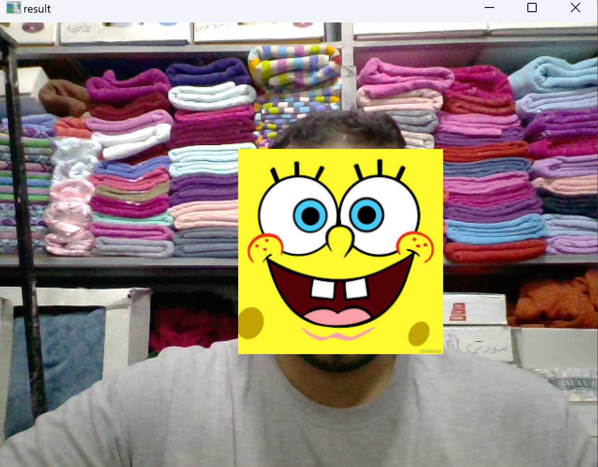
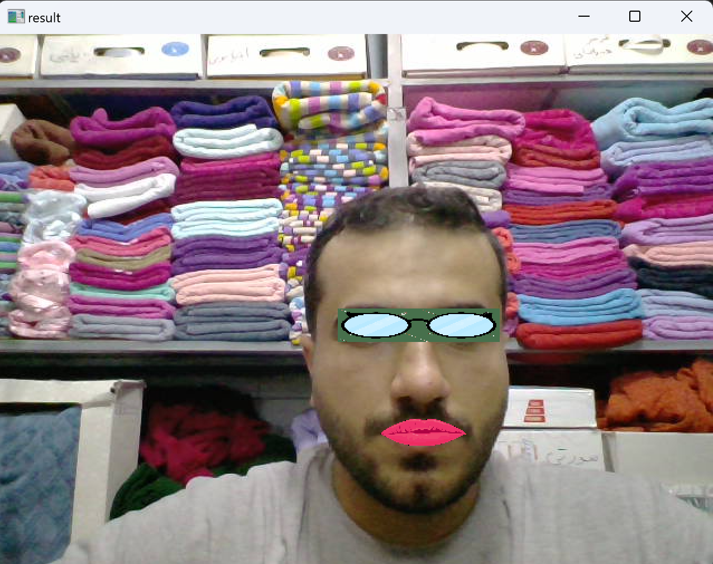
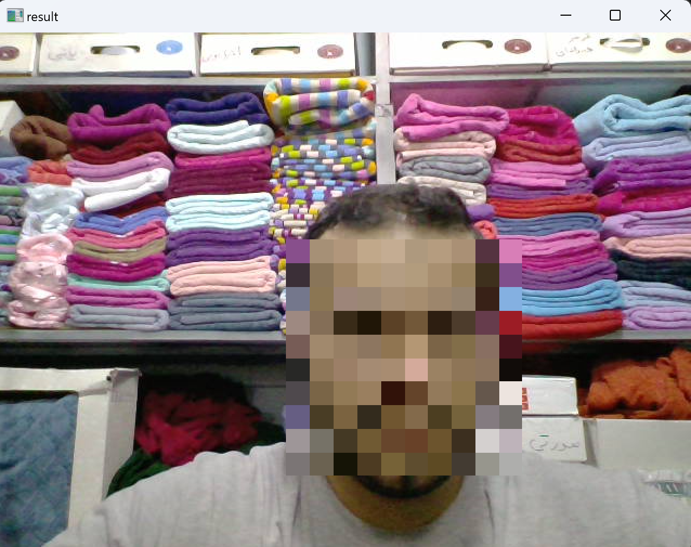
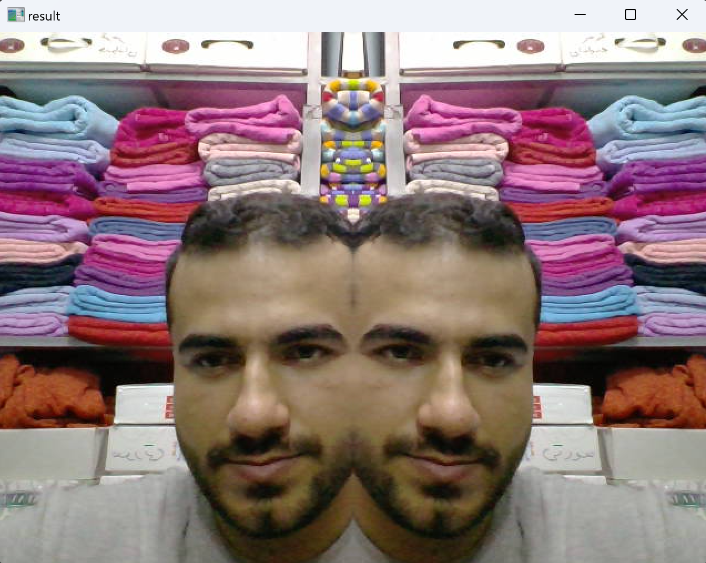

# Assigment 28

# 1. Cats Face Detection 😸
A simple face detector project using opencv with python that you can give an image and count number of cats


## How to install
Run following command:
```
pip install -r requirments.txt
```
## How to Run
Execute this command in terminal:

```
python Cat_Detector.py
```

## Results



# 2. Football pitch ⚽

A simple project using opencv and numpy with python that draw a RGB football picth,
in this project I use cv2.rectangle , cv2.line and cv2.circle

## How to install
Run following command:
```
pip install -r requirments.txt
```

## How to Run
Execute this command in terminal:

```
python Football_Pitch.py
```
## Results


# 3. Webcam Face Filter 


A simple face detector project using opencv with python that if you press number 1 to 4 on keyboard will apply some changes on your face.


## How to Install
Run following command:
```
pip install -r requirments.txt
```

## How to Run
Execute this command in terminal:

```
python Webcam_Face_Filters.py
```


## Results
>###  Non-Square sticker on face 🙂
If Press 1 on Keyboard Sticker will be on your Face



---------------------------------------------------
>###  Glasses & lip stickers 👄😎👓
If Press 2 on Keyboard Stickers of Glasses and Lips will be on your Face



---------------------------------------------------
>### Chess Face 
If Press 3 on Keyboard Chess Board will be on your Face



---------------------------------------------------
>### Mirror Filter 💠
Finally,If Press 4 on Keyboard Mirror Filter will be Apply on your Frame


